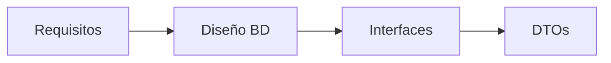
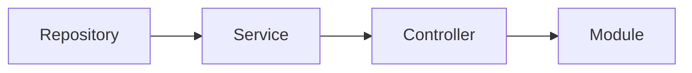
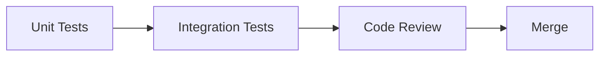

# 🚀 Guía de Desarrollo de Features

Este documento establece las convenciones, reglas y políticas para desarrollar nuevas features en el proyecto **ops-monitoring**.

---

## 📋 Tabla de Contenidos

1. [Principios Fundamentales](#principios-fundamentales)
2. [Estructura de Features](#estructura-de-features)
3. [Convenciones de Exportación](#convenciones-de-exportación)
4. [Repositorios](#repositorios)
5. [Servicios](#servicios)
6. [Controladores](#controladores)
7. [DTOs y Validación](#dtos-y-validación)
8. [Módulos](#módulos)
9. [Flujo de Desarrollo](#flujo-de-desarrollo)
10. [Checklist de Feature](#checklist-de-feature)

---

## 🎯 Principios Fundamentales

### 1. **Consistencia es Clave**

- Mantén el mismo patrón en todo el código
- Si existe un patrón, síguelo
- Si necesitas desviarte, documenta el por qué

### 2. **Export Default Siempre**

- **TODOS** los archivos TypeScript deben usar `export default`
- Esto mantiene consistencia en las importaciones

### 3. **Separación de Responsabilidades**

- Repositorios: Acceso a datos
- Servicios: Lógica de negocio
- Controladores: Manejo de requests/responses
- DTOs: Validación de datos

### 4. **TypeScript Estricto**

- Siempre tipar todas las variables
- Evitar `any` a toda costa
- Usar interfaces para contratos

---

## 📦 Convenciones de Exportación

### ✅ SIEMPRE usar Export Default

```typescript
// ✅ CORRECTO
export default class PersonService {
  // ...
}

// ❌ INCORRECTO
export class PersonService {
  // ...
}
```

### Importaciones con Export Default

```typescript
// ✅ CORRECTO
import PersonService from './person.service';
import PersonRepository from '../repositories/person.repository';

// ❌ INCORRECTO
import { PersonService } from './person.service';
```

### Múltiples Exports (Excepciones)

Solo para constantes, interfaces y tipos:

```typescript
// interfaces/person.interface.ts
export interface PersonFilterOptions {
  companyId: string;
  status: StatusEnum;
}

export interface PersonSearchResult {
  data: Person[];
  total: number;
}

export default interface IPerson {
  id: string;
  firstName: string;
  lastName: string;
}
```

---

## 🗄️ Repositorios

### Repository Base (Extendiendo AbstractRepository)

```typescript
// repositories/person.repository.ts
import AbstractRepository from '@libs/common/src/sequelize/crud/abstract.repository';
import { Person } from '@sequelize/models';

export default class PersonRepository extends AbstractRepository<Person> {
  constructor() {
    super(Person);
  }
}
```

### Repository Personalizado (Queries Complejas)

Crear un repository personalizado cuando necesites:

- Queries con múltiples JOINs
- Agregaciones complejas (GROUP BY, HAVING)
- Queries SQL raw
- Operaciones en batch optimizadas

```typescript
// repositories/person-custom.repository.ts
import { Op, QueryTypes } from 'sequelize';
import sequelize from '@libs/common/src/sequelize/sequelize.config';
import { Person } from '@sequelize/models';

export default class PersonCustomRepository {
  /**
   * Query compleja con múltiples JOINs y agregaciones
   */
  public async findPersonsWithTransactionStats(
    companyId: string,
    dateFrom: Date,
    dateTo: Date,
  ): Promise<any[]> {
    const query = `
      SELECT 
        p.id,
        p.first_name,
        p.last_name,
        COUNT(DISTINCT t.id) as total_transactions,
        SUM(t.amount) as total_amount,
        AVG(t.amount) as avg_amount,
        MAX(t.created_at) as last_transaction_date
      FROM persons p
      LEFT JOIN transactions t ON t.person_id = p.id
      WHERE p.company_id = :companyId
        AND t.created_at BETWEEN :dateFrom AND :dateTo
      GROUP BY p.id, p.first_name, p.last_name
      HAVING COUNT(t.id) > 0
      ORDER BY total_amount DESC
    `;

    const results = await sequelize.query(query, {
      replacements: { companyId, dateFrom, dateTo },
      type: QueryTypes.SELECT,
    });

    return results;
  }

  /**
   * Query con búsqueda full-text
   */
  public async searchPersonsFullText(
    searchTerm: string,
    companyId: string,
  ): Promise<Person[]> {
    return Person.findAll({
      where: {
        companyId,
        [Op.or]: [
          sequelize.where(
            sequelize.fn(
              'concat',
              sequelize.col('first_name'),
              ' ',
              sequelize.col('last_name'),
            ),
            { [Op.iLike]: `%${searchTerm}%` },
          ),
          { documentNumber: { [Op.iLike]: `%${searchTerm}%` } },
          { email: { [Op.iLike]: `%${searchTerm}%` } },
        ],
      },
      include: [
        {
          model: PaymentMethod,
          where: {
            [Op.or]: [
              { lastDigits: { [Op.iLike]: `%${searchTerm}%` } },
              { bankName: { [Op.iLike]: `%${searchTerm}%` } },
            ],
          },
          required: false,
        },
      ],
    });
  }

  /**
   * Operación batch optimizada
   */
  public async bulkUpdatePersonStatus(
    personIds: string[],
    status: string,
    companyId: string,
  ): Promise<[number, Person[]]> {
    return Person.update(
      { status },
      {
        where: {
          id: { [Op.in]: personIds },
          companyId,
        },
        returning: true,
      },
    );
  }
}
```

### Cuándo Usar Cada Tipo

| Tipo                         | Uso                                                         |
| ---------------------------- | ----------------------------------------------------------- |
| **AbstractRepository**       | CRUD básico, queries simples con findOne, findAll           |
| **Repository Personalizado** | Queries complejas, JOINs múltiples, agregaciones, SQL raw   |
| **Ambos**                    | Feature compleja que necesita CRUD + queries especializadas |

---

## 🔧 Servicios

### Estructura de un Servicio

```typescript
// services/person.service.ts
import { Injectable, BadRequestException } from '@nestjs/common';
import { Op } from 'sequelize';
import PersonRepository from '../repositories/person.repository';
import PersonCustomRepository from '../repositories/person-custom.repository';
import CreatePersonDto from '../dto/create-person.dto';
import PaginationDto from '@dto/pagination.dto';
import { CUSTOM_RES } from '@libs/common/src/constants/messages.constant';

@Injectable()
export default class PersonService {
  private readonly repository: PersonRepository;
  private readonly customRepository: PersonCustomRepository;
  private readonly selectOrder: SelectOrderInterface[];

  constructor() {
    this.repository = new PersonRepository();
    this.customRepository = new PersonCustomRepository();
    this.selectOrder = [
      { label: 'Nombre', value: 'first_name', select: false },
      { label: 'Apellido', value: 'last_name', select: false },
      { label: 'Fecha creación', value: 'created_at', select: true },
    ];
  }

  /**
   * Crear una nueva persona
   */
  public async createPerson(
    dto: CreatePersonDto,
    companyId: string,
  ): Promise<Person> {
    // Validación de negocio
    const existing = await this.repository.findOne({
      documentNumber: dto.documentNumber,
      companyId,
    });

    if (existing) {
      throw new BadRequestException(
        CUSTOM_RES({ code: 'OPS-001', message: 'Persona ya existe' }),
      );
    }

    // Crear
    return this.repository.create({
      ...dto,
      companyId,
    });
  }

  /**
   * Listar personas con paginación y filtros
   */
  public async listPaginatedPersons(
    status: StatusListEnum,
    dto: PaginationDto,
    companyId: string,
  ): Promise<{ response: any; selectOrder: SelectOrderInterface[] }> {
    const selectOrder = this.generateOrderSelect(dto);
    const options = this.generateOptionsList(dto);
    const where = this.generateOptionsListFilter(companyId, status, dto);

    const response = await this.repository.findAllPaginated(
      dto,
      where,
      options,
    );

    return { response, selectOrder };
  }

  /**
   * Obtener estadísticas de personas (usa repository personalizado)
   */
  public async getPersonStatistics(
    companyId: string,
    dateFrom: Date,
    dateTo: Date,
  ): Promise<any[]> {
    return this.customRepository.findPersonsWithTransactionStats(
      companyId,
      dateFrom,
      dateTo,
    );
  }

  // Métodos privados de utilidad
  private generateOrderSelect(dto: PaginationDto): SelectOrderInterface[] {
    const { orderBy } = dto;

    const selectedOrder = this.selectOrder.map((order) => ({
      ...order,
      select: order.value === orderBy,
    }));

    const exists = this.selectOrder.some((o) => o.value === orderBy);

    if (orderBy && !exists) {
      throw new BadRequestException(
        CUSTOM_RES({ code: 'OPS-004', message: 'Orden no permitida' }),
      );
    }

    return selectedOrder;
  }

  private generateOptionsList(dto: PaginationDto): any {
    const { orderBy, orderDirection } = dto;

    const order = orderBy
      ? [[orderBy, orderDirection || 'ASC']]
      : [['created_at', 'DESC']];

    return {
      attributes: [
        'id',
        'firstName',
        'lastName',
        'documentNumber',
        'createdAt',
      ],
      order,
      include: [
        {
          model: Company,
          attributes: ['name'],
        },
      ],
    };
  }

  private generateOptionsListFilter(
    companyId: string,
    status: StatusListEnum,
    dto: PaginationDto,
  ): WhereOptions {
    const { search } = dto;
    let where: WhereOptions = { companyId };

    // Filtro por estado
    switch (status) {
      case StatusListEnum.ONLY_ACTIVE:
        where.deletedAt = null;
        break;
      case StatusListEnum.ONLY_BLOCKED:
        where.blockingReasonId = { [Op.not]: null };
        break;
    }

    // Búsqueda
    if (search) {
      where[Op.or] = [
        { firstName: { [Op.iLike]: `%${search}%` } },
        { lastName: { [Op.iLike]: `%${search}%` } },
        { documentNumber: { [Op.iLike]: `%${search}%` } },
      ];
    }

    return where;
  }
}
```

### Reglas para Servicios

1. **Inyectar repositorios en el constructor**
2. **Métodos públicos para operaciones de negocio**
3. **Métodos privados para utilidades internas**
4. **Validación de negocio antes de operaciones de BD**
5. **Usar mensajes constantes para errores**
6. **Documentar métodos públicos con JSDoc**

---

## 🎮 Controladores

Cada feature tiene **un único controlador** REST que recibe las requests y delega toda la lógica al servicio.

```typescript
// controllers/person.controller.ts

import {
  Controller,
  Post,
  Get,
  Patch,
  Delete,
  Body,
  Param,
  Query,
  UseGuards,
} from '@nestjs/common';
import { AuthGuard } from '@nestjs/passport';
import { RolesGuard } from '../guards/roles.guard';
import { Roles } from '../decorators/roles.decorator';
import { GetUser } from '../decorators/get-user.decorator';
import PersonService from '../services/person.service';
import CreatePersonDto from '../dto/create-person.dto';
import UpdatePersonDto from '../dto/update-person.dto';

import PaginationDto from '@dto/pagination.dto';
import { User } from '@sequelize/models';
import { RolesEnum } from '@enums/roles.enum';
import { StatusListEnum } from '@enums/status-list.enum';

@Controller('persons')
@UseGuards(AuthGuard('jwt'), RolesGuard)
export default class PersonController {
  constructor(private readonly personService: PersonService) {}

  @Post()
  @Roles(RolesEnum.ADMIN)
  public async createPerson(
    @Body() dto: CreatePersonDto,
    @GetUser() user: User,
  ) {
    return this.personService.createPerson(dto, user.companyId);
  }

  @Get(':id')
  @Roles(RolesEnum.ADMIN, RolesEnum.SUPERVISOR, RolesEnum.OPERATOR)
  public async findPerson(@Param('id') id: string, @GetUser() user: User) {
    return this.personService.findPersonById(id, user.companyId);
  }

  @Get()
  @Roles(RolesEnum.ADMIN, RolesEnum.SUPERVISOR, RolesEnum.OPERATOR)
  public async listPersons(
    @Query() dto: PaginationDto,
    @Query('status') status: StatusListEnum = StatusListEnum.ALL,
    @GetUser() user: User,
  ) {
    return this.personService.listPaginatedPersons(status, dto, user.companyId);
  }

  @Patch(':id')
  @Roles(RolesEnum.ADMIN)
  public async updatePerson(
    @Param('id') id: string,
    @Body() dto: UpdatePersonDto,
    @GetUser() user: User,
  ) {
    return this.personService.updatePerson(id, dto, user.companyId);
  }

  @Delete(':id')
  @Roles(RolesEnum.ADMIN)
  public async deletePerson(@Param('id') id: string, @GetUser() user: User) {
    return this.personService.deletePerson(id, user.companyId);
  }
}
```

### Reglas para Controladores

1. **Sin lógica de negocio** — solo recibe la request y llama al servicio
2. **Guards de autenticación y roles** en todos los endpoints
3. **Decorador `@GetUser()`** para obtener el usuario autenticado
4. **Un controlador por feature**

---

## 📝 DTOs y Validación

### DTO de Creación

```typescript
// dto/create-person.dto.ts
import {
  IsString,
  IsNotEmpty,
  IsEmail,
  IsOptional,
  Matches,
} from 'class-validator';

export default class CreatePersonDto {
  @IsString()
  @IsNotEmpty()
  firstName: string;

  @IsString()
  @IsNotEmpty()
  lastName: string;

  @IsString()
  @IsNotEmpty()
  @Matches(/^[0-9]+$/, { message: 'Document must contain only numbers' })
  documentNumber: string;

  @IsEmail()
  @IsOptional()
  email?: string;

  @IsString()
  @IsOptional()
  phone?: string;
}
```

### DTO de Actualización (Partial)

```typescript
// dto/update-person.dto.ts
import { PartialType } from '@nestjs/mapped-types';
import CreatePersonDto from './create-person.dto';

export default class UpdatePersonDto extends PartialType(CreatePersonDto) {}
```

### DTO Personalizado

```typescript
// dto/block-or-unblock-person.dto.ts
import { IsBoolean, IsString, IsOptional } from 'class-validator';

export default class BlockOrUnblockPersonDto {
  @IsBoolean()
  block: boolean;

  @IsString()
  @IsOptional()
  blockingReasonId?: string;
}
```

---

## 📦 Módulos

### Estructura del Módulo

```typescript
// person.module.ts
import { Module } from '@nestjs/common';
import PersonController from './controllers/person.controller';
import PersonService from './services/person.service';

@Module({
  controllers: [PersonController],
  providers: [PersonService],
  exports: [PersonService], // Solo exportar lo necesario
})
export default class PersonModule {}
```

### Registro en el Módulo Principal

```typescript
// app.module.ts
import PersonModule from './person/person.module';

@Module({
  imports: [
    // ... otros módulos
    PersonModule,
  ],
})
export default class AppModule {}
```

---

## 🔄 Flujo de Desarrollo

### 1. Planificación



### 2. Implementación



### 3. Testing



### Paso a Paso para Nueva Feature

1. **Crear la migración de BD** (si aplica)

   ```bash
   npm run migration:create -- --name=create-[feature-name]-table
   ```

2. **Crear el modelo Sequelize**

   ```typescript
   // sequelize/models/[feature-name].model.ts
   ```

3. **Crear la estructura de carpetas**

   ```bash
   mkdir -p src/[feature-name]/{controllers,services,repositories,dto,interfaces}
   ```

4. **Implementar en orden:**
   - Repository (extender AbstractRepository)
   - DTOs (validación)
   - Service (lógica de negocio)
   - Controller (endpoints REST)
   - Module (registrar todo)

5. **Escribir tests**

   ```bash
   mkdir -p __tests__/src/[feature-name]/{services,repositories,controllers}
   ```

6. **Documentar** (si es feature compleja)

---

## ✅ Checklist de Feature

Antes de considerar una feature como completa:

### Estructura

- [ ] Carpeta de feature creada en `src/[feature-name]/`
- [ ] Subcarpetas: controllers, services, repositories, dto, interfaces
- [ ] Todos los archivos usan `export default`

### Base de Datos

- [ ] Migración creada y ejecutada
- [ ] Modelo Sequelize creado
- [ ] Relaciones definidas
- [ ] Índices agregados donde corresponda

### Repository

- [ ] Repository base extendiendo AbstractRepository
- [ ] Repository personalizado si hay queries complejas
- [ ] Métodos documentados con JSDoc

### Service

- [ ] Lógica de negocio implementada
- [ ] Validaciones de negocio
- [ ] Manejo de errores con CUSTOM_RES
- [ ] Métodos privados para utilidades
- [ ] Transacciones donde sea necesario

### Controller

- [ ] Endpoints REST definidos (GET, POST, PATCH, DELETE)
- [ ] Guards de autenticación aplicados
- [ ] Roles definidos para cada endpoint
- [ ] Validación de DTOs automática
- [ ] Sin lógica de negocio en el controller

### DTOs

- [ ] DTO de creación
- [ ] DTO de actualización (PartialType)
- [ ] DTOs específicos si son necesarios
- [ ] Validadores de class-validator aplicados
- [ ] Mensajes de error personalizados

### Module

- [ ] Module de feature creado
- [ ] Controller registrado
- [ ] Providers registrados
- [ ] Exports definidos (solo lo necesario)
- [ ] Module importado en AppModule

### Testing

- [ ] Tests unitarios para service (>95% cobertura)
- [ ] Tests unitarios para repository
- [ ] Tests unitarios para controller
- [ ] Tests de integración si aplica
- [ ] Mocks correctamente implementados

### Documentación

- [ ] JSDoc en métodos públicos
- [ ] README de feature si es compleja
- [ ] Ejemplos de uso en Postman/Swagger
- [ ] Documentación de queries complejas

### Code Quality

- [ ] Sin warnings de ESLint
- [ ] Sin `any` types
- [ ] Sin console.log
- [ ] Sin código comentado
- [ ] Nombres descriptivos
- [ ] Código DRY (Don't Repeat Yourself)

---

## 🚫 Anti-Patterns a Evitar

### ❌ NO HACER

```typescript
// ❌ No usar export named
export class PersonService {}

// ❌ No mezclar lógica de negocio en controllers
@Controller('persons')
export default class PersonController {
  @Post()
  async create(@Body() dto: CreatePersonDto) {
    // ❌ Validación de negocio en controller
    const exists = await Person.findOne({ where: { email: dto.email } });
    if (exists) throw new Error('Email exists');
    return Person.create(dto);
  }
}

// ❌ No usar any
const result: any = await this.repository.findAll();

// ❌ No hacer queries en el controller
const persons = await Person.findAll({ where: { companyId } });

// ❌ No hardcodear valores
const limit = 10; // Usar constantes o configuración

// ❌ No ignorar errores
try {
  await this.service.create(dto);
} catch (error) {
  // No hacer nada
}
```

### ✅ HACER

```typescript
// ✅ Usar export default
export default class PersonService {}

// ✅ Lógica en servicios
@Injectable()
export default class PersonService {
  async createPerson(dto: CreatePersonDto) {
    await this.validateUniqueness(dto);
    return this.repository.create(dto);
  }
}

// ✅ Tipar todo
const result: Person[] = await this.repository.findAll();

// ✅ Usar repositorios
const persons = await this.personRepository.findAllByCompany(companyId);

// ✅ Usar constantes
const DEFAULT_PAGE_SIZE = 10;

// ✅ Manejar errores apropiadamente
try {
  await this.service.create(dto);
} catch (error) {
  this.logger.error('Error creating person:', error);
  throw new BadRequestException(
    CUSTOM_RES({ code: 'OPS-001', message: error.message }),
  );
}
```

---

## 📚 Referencias y Ejemplos

### Features de Referencia en el Proyecto

Estas features siguen perfectamente las convenciones:

1. **Payment Method** (`src/payment-method/`)
   - Ejemplo de CRUD completo
   - Repository personalizado para queries complejas
   - Filtros avanzados con paginación

2. **Person** (`src/person/`)
   - Separación de servicios (Person y CompanyPersonOps)
   - Manejo de relaciones many-to-many
   - Búsqueda con múltiples criterios

3. **Company Blocked BIN** (`src/company-blocked-bin/`)
   - Patrón de listado con estados
   - Validaciones de negocio complejas
   - Uso de transacciones

### Documentación Externa

- [NestJS Documentation](https://docs.nestjs.com)
- [Sequelize Documentation](https://sequelize.org)
- [TypeScript Best Practices](https://www.typescriptlang.org/docs/handbook/declaration-files/do-s-and-don-ts.html)
- [Clean Code JavaScript](https://github.com/ryanmcdermott/clean-code-javascript)

---

## 🤝 Contribuir

Si encuentras que algo puede mejorar o necesitas desviarte de estas convenciones:

1. Documenta el por qué
2. Discute con el equipo
3. Actualiza esta guía si se aprueba el cambio
4. Aplica el cambio consistentemente

---

## 📞 FAQ

**P: ¿Puedo usar una librería externa?**
R: Sí, pero evalúa si realmente la necesitas. Prefiere soluciones nativas cuando sea posible.

**P: ¿Qué hago si necesito una query muy compleja?**
R: Crea un repository personalizado. Si es SQL raw, documenta bien el query.

**P: ¿Puedo saltarme el repository y usar el modelo directamente?**
R: No. Siempre usa repositories para mantener la separación de responsabilidades.

**P: ¿Dónde pongo lógica compartida entre features?**
R: En `libs/common/src/` o crea un servicio compartido.

**P: ¿Cómo manejo transacciones?**
R: Usa el método `transaction()` del AbstractRepository y pasa la transacción entre métodos.

---

**Última actualización:** Noviembre 2025  
**Versión:** 1.1.0  
**Mantenido por:** Equipo de Desarrollo ops-monitoring
